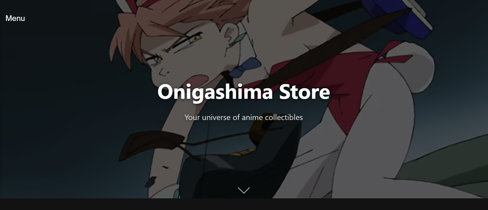

# Onigashima Store - Anime Collectibles Web App

Welcome to the Onigashima Store, a modern and dynamic e-commerce web application built for anime enthusiasts. This project showcases a seamless user experience with smooth scrolling, fluid animations, and a complete set of online store functionalities, from browsing a catalog to a secure checkout process.

## Screenshot




## Key Features

- **Modern UI/UX:** A sleek, dark-themed interface with professional, smooth animations.
- **Smooth Scrolling:** Integrated with `@studio-freight/lenis` for a fluid browsing experience.
- **Dynamic Animations:** Scroll-triggered animations powered by GSAP (GreenSock Animation Platform) to bring content to life.
- **User Authentication:** Secure sign-up and login functionality managed with Supabase Auth.
- **Product Catalog:** Browse a grid of available anime figures and products fetched from a Supabase database.
- **Shopping Cart:** A fully persistent shopping cart using React Context and `localStorage`.
- **Protected Routes:** A secure checkout page accessible only to authenticated users.
- **Responsive Design:** A mobile-first approach ensuring the store looks great on all devices.

## Tech Stack

This project was built using a modern frontend stack:

- **Framework:** [React](https://reactjs.org/)
- **Build Tool:** [Vite](https://vitejs.dev/)
- **Backend as a Service (BaaS):** [Supabase](https://supabase.io/) for database and authentication.
- **Routing:** [React Router](https://reactrouter.com/)
- **Animation:**
  - [GSAP (GreenSock Animation Platform)](https://greensock.com/gsap/)
  - [@studio-freight/lenis](https://github.com/darkroomengineering/lenis) for smooth scrolling.
- **State Management:** React Context API (for Cart and Auth state).
- **Styling:** Plain CSS with modern features like glassmorphism (`backdrop-filter`).

## Project Structure

The `src` folder is organized to maintain a clean and scalable codebase:

```
src/
├── assets/         # Static files like images, videos, and global styles
├── components/     # Reusable React components (Navbar, Footer, Spinner, etc.)
├── context/        # React Context providers (AuthContext, CartContext)
├── pages/          # Page components corresponding to routes (Home, Catalog, Login, etc.)
├── App.jsx         # Main application component with routing structure
├── main.jsx        # Entry point of the application
└── supabaseClient.js # Supabase client initialization
```

## Author project
JavGarin
